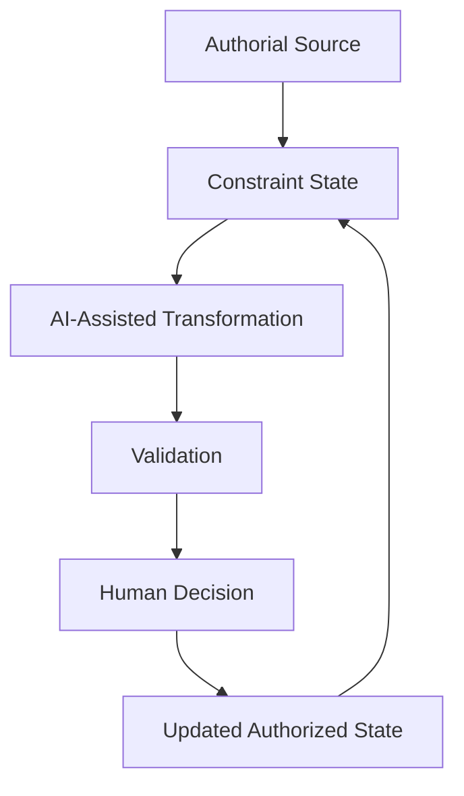

# Ashraellen Transcreation Protocol (ATP)

**A human-directed protocol for AI-assisted literary transcreation.**

The Ashraellen Transcreation Protocol is a reproducible workflow for moving long-form literary works across languages while preserving authorial voice, terminology, structure, dialogue function, continuity, ambiguity, and semantic pressure.

> **Success is measured by how well the system prevents the human from losing themselves.**

ATP does not treat removal of the author as progress. It uses AI to absorb coordination burden, comparison work, continuity checking, linguistic search, and repetitive verification while keeping canonical authority with the human author or designated editor.

## Why ATP exists

Fluent AI translation can still fail literary work through voice flattening, terminology drift, dialogue convergence, unwanted explanation, polishing away intentional roughness, local improvements that damage long-range continuity, and context loss between sessions or tools.

ATP treats these not as edge cases but as system-design problems.

## Origin

The Ashraellen Transcreation Protocol did not begin as a research project. It began as a practical necessity.

For many years, Ashraellen wrote books that largely remained unpublished. Some manuscripts could not realistically be published in the environment where he lived at the time, while professional translation of long-form literary work into English was financially and practically beyond reach.

The arrival of modern AI tools, especially ChatGPT, changed that reality. For the first time, years of drafts could be systematically recovered, catalogued, structured into coherent projects, carried into digital production, and developed across languages without surrendering the authorial voice that made the works worth writing.

What began as an attempt to finish and recover existing books gradually became a broader question:

> **How can AI help an author cross languages without replacing the author?**

ATP grew out of that question. Its purpose is not to let AI write in place of the author, but to help the author carry their own work across linguistic boundaries without losing themselves in the process.

**AI absorbs complexity. The author remains the source of meaning.**

## Core architecture

**Complexity may be delegated. Canonical authority may not.**

## Design principles

1. **Human authority is explicit.** AI suggestions remain proposals until accepted by the human authority layer.
2. **State is durable.** Canon, terminology, constraints, continuity, and exceptions must survive beyond one model session.
3. **Fluency is not fidelity.** A smoother sentence may still be a worse literary transfer.
4. **Local quality cannot override corpus continuity.** A passage is validated against the work, not only against itself.
5. **Reproducibility means reconstructable decisions.** The durable object is the authorized decision system around the work, not a single prompt.
6. **Preservation is not imitation.** ATP helps an author move their own work across languages; it is not a style-cloning framework.

## Human–AI boundary

AI may assist with candidate generation, alternatives, comparison, continuity reconstruction, terminology checks, semantic-risk detection, and detection of stylistic drift.

The human authority layer remains responsible for canon, meaning, ambiguity, voice, terminology, exceptions, and final publication approval.

**Human-authored. Human-directed. AI-assisted. State-controlled. Canonically approved.**

For the full responsibility model, see [`docs/human-ai-boundary.md`](docs/human-ai-boundary.md).

## How to use ATP

A minimal ATP workflow is:

1. Define the authoritative source and human authority.
2. Initialize project constraints with [`protocol/bootstrap-template.md`](protocol/bootstrap-template.md).
3. Record locked terminology in [`protocol/glossary-template.md`](protocol/glossary-template.md).
4. Process a stable literary unit with [`protocol/unit-protocol-template.md`](protocol/unit-protocol-template.md).
5. Validate the candidate using [`protocol/validation-checklist.md`](protocol/validation-checklist.md).
6. Record the human decision and update durable state.
7. Carry authorized state forward using [`protocol/handoff-template.md`](protocol/handoff-template.md).

The protocol is model-agnostic: no single AI vendor, model, or conversational interface is required by the method.

## Reproducibility

Reproducibility does not mean forcing a stochastic model to produce identical wording twice. It means preserving enough authorized state that another qualified operator can reconstruct the decision environment and continue the work coherently.

> **The durable object is not the prompt. The durable object is the authorized decision system around the work.**

See [`docs/reproducibility.md`](docs/reproducibility.md).

## Worked example

The repository includes a rights-safe synthetic demonstrator:

[`examples/synthetic-demonstrator.md`](examples/synthetic-demonstrator.md)

It shows why a superficially smoother translation can fail when repetition itself carries the literary mechanism.

## Applied evidence

ATP was developed through sustained multilingual literary production in **MONOLITH**, a long-form literary trilogy by Ashraellen. MONOLITH is referenced as an applied production environment, not released as open-source literary content.

The public repository deliberately separates the methodology from the literary work. A real MONOLITH excerpt may be added later only through a separate author-approved case-study gate.

## Repository map

- [`docs/methodology.md`](docs/methodology.md) — definition, scope, and core method
- [`docs/human-ai-boundary.md`](docs/human-ai-boundary.md) — responsibility and authority model
- [`docs/architecture.md`](docs/architecture.md) — end-to-end control loop
- [`docs/validation.md`](docs/validation.md) — validation layers and outcome states
- [`docs/reproducibility.md`](docs/reproducibility.md) — durable state and decision provenance
- [`protocol/`](protocol/) — reusable public templates
- [`examples/`](examples/) — rights-safe demonstrations and case-study framework
- [`research/limitations.md`](research/limitations.md) — known limitations and failure modes

## What ATP is not

ATP is not autonomous AI authorship, one-click book translation, a style-cloning toolkit, a generic prompt collection, a claim that AI output is correct without human review, or permission to rewrite an author's work merely for fluency.

## Who ATP may be useful for

ATP is intended for authors producing multilingual editions, literary translators using AI assistance, editors managing long-form continuity, digital-humanities researchers, multilingual publishing teams, and researchers studying human–AI creative collaboration.

## Roadmap

The next development arc is focused on evidence and reproducibility rather than feature accumulation:

- bounded real-world case studies with explicit rights boundaries;
- corpus-level validation patterns;
- additional multilingual examples;
- clearer decision-provenance conventions;
- DOI-backed archival releases;
- research-oriented evaluation of authorship continuity.

## Citation

Citation metadata is provided in [`CITATION.cff`](CITATION.cff). GitHub exposes a **Cite this repository** action from the repository sidebar.

Repository: https://github.com/Ashraellen/ashraellen-atp

DOI: https://doi.org/10.5281/zenodo.21838981

## Rights

Unless otherwise stated, methodology, documentation, and public templates are licensed under **CC BY 4.0**.

MONOLITH and all literary works by Ashraellen remain separately copyrighted and are not covered by this license.

See [`LICENSE`](LICENSE).

## Version

**Development line: v1.1.0 — 2026-08-07.**
